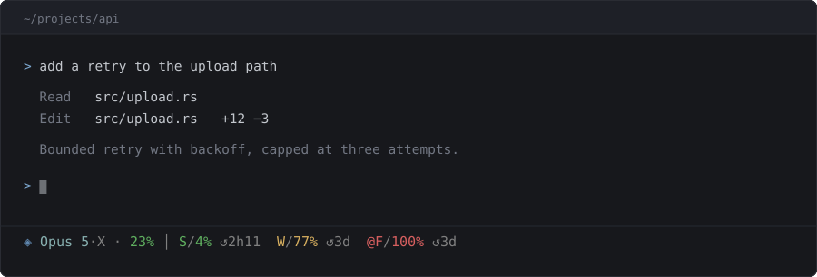

# AImeter

Your Claude Code rate limits, in the statusline. One binary, ~2 ms, no daemon.



## What you are looking at


## Get it

```bash
curl -fsSL https://raw.githubusercontent.com/MarioPayan/AImeter/main/install.sh | sh
```

Downloads the right binary, wires your statusline, and is safe to run twice — it backs up
an existing statusline script before appending, and never overrides a `statusLine` you
already set. Pass `--no-wire` to skip the wiring. Short enough to
[read first](install.sh), which you should do with anything you pipe into a shell.

**Or ask Claude Code:**

> Install AImeter from github.com/MarioPayan/AImeter

Prefer to do it yourself? [Installing by hand](docs/how-it-works.md#installing-by-hand).

## Why

| | |
|---|---|
| **Already on screen** | You never ask. Asking Claude costs a round trip and some context |
| **Spends nothing** | No model call, no tokens, no context — it reads files and prints a line |
| **Four ceilings** | Session, week, capped model, context — the limits say when they reset |
| **Never lies** | Stale goes grey, a reset window shows `—`, a missing reset stays blank |
| **Nothing running** | No daemon, no database. ~2 ms per render; `node` costs 60–100 |

**[How it works](docs/how-it-works.md)**
