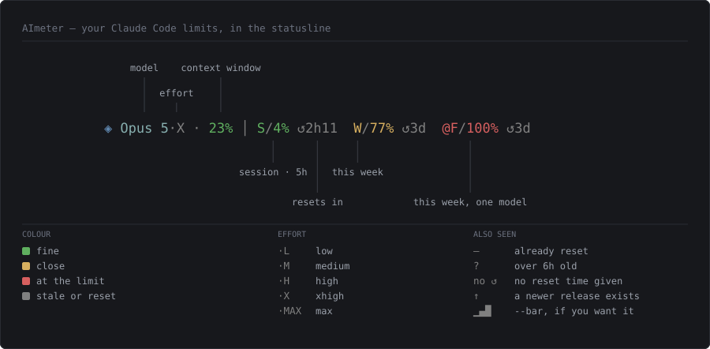

# aimeter

AI coding-tool usage, where you already look.

A statusline segment showing your session, weekly and per-model limits. No daemon, no
database, nothing to keep running — one binary that prints one line in a couple of
milliseconds and exits.

**Claude Code is the only provider today.** The name is the room to add others, not a
claim that they exist: there is no provider abstraction yet, because one implementation
does not tell you where the seam goes. The second provider is what will show that, and
`limits.rs` is where it would land.

```
[PONYTAIL]  [KAIZEN] 38 awaiting you  ◈ Opus 5·X · 37% │ S/12% ↺34m  W/2% ↺6d  @F/0%
                                      ╰──────┬───────╯   ╰──────────────┬──────────────╯
                                       this session,              your allowance,
                                         right now                   over time
```

Left of the divider: the model, its reasoning effort (`X` for xhigh), and how full the
context window is. Right of it: how much of each limit you have spent and when it resets
— `S` session, `W` week, `@F` the window scoped to Fable. Colour says which one needs
you; the slash and the clock stay grey so they never compete for that job.

## Reading the segment



Every piece, and every value it can take.

### The shape

```
◈  Opus 5  ·X   ·  23%   │   S / 4%  ↺2h11
│  │       │       │     │   │ │ │   │
│  │       │       │     │   │ │ │   └─ when this window resets
│  │       │       │     │   │ │ └───── how much of it you have spent
│  │       │       │     │   │ └─────── separator, always grey
│  │       │       │     │   └───────── which window
│  │       │       │     └───────────── divider: session ends, allowance begins
│  │       │       └─────────────────── how full the context window is
│  │       └─────────────────────────── reasoning effort
│  └─────────────────────────────────── the model you are talking to
└────────────────────────────────────── the segment mark
```

### Windows

| Label | Window | Where it comes from |
|---|---|---|
| `S` | session, the 5-hour window | stdin, or the usage endpoint |
| `W` | the 7-day window across all models | stdin, or the usage endpoint |
| `@F` | the 7-day window scoped to one model — `@` plus its initial | usage endpoint or `~/.claude.json` only |
| `@` | a scoped window whose model has no name | as above |

`@S` is the Sonnet-scoped window and never the session: the `@` is what distinguishes
them, not the letter, so a model whose name starts with `S` cannot be misread.

### Reasoning effort

| Mark | `effort.level` |
|---|---|
| `L` | low |
| `M` | medium |
| `H` | high |
| `X` | xhigh |
| `MAX` | max |

`max` spells itself out because `medium` already has `M`. A level this doesn't recognise
prints nothing — a wrong letter is worse than none.

### Values

| Shown | Means |
|---|---|
| `4%` | percent of the window spent, rounded |
| `—` | the window has already reset, so the last reading describes a counter that no longer exists |
| `↺18m` | resets in 18 minutes — minutes under an hour |
| `↺2h11` | resets in 2 hours 11 minutes — hours and minutes under a day |
| `↺6d` | resets in 6 days — whole days beyond that |
| *(no clock)* | the window reported no `resets_at`. The scoped window does this in the wild |
| `?` at the end | at least one number on the line is more than six hours old |
| `▁▂▃▄▅▆▇█` | the `--bar` fill, eight levels across 0–100% |

### Colour

Severity comes from the API's own `severity` field wherever it sends one — Anthropic
knows when 78% is a warning better than a threshold invented here. The context window and
stdin's rate limits send a percentage and no opinion, so those use 0–49 normal, 50–89
warning, 90+ critical.

| Role | xterm-256 | Hex | Used for |
|---|---|---|---|
| mark | 67 | `#5f87af` | the leading `◈` |
| model | 109 | `#87afaf` | the model name |
| normal | 71 | `#5faf5f` | a window with room |
| warning | 179 | `#d7af5f` | severity `warning` |
| critical | 167 | `#d75f5f` | severity `critical` |
| dim | 244 | `#808080` | every slash, clock, divider and effort mark — and *any* value that is stale or reset |

Two rules hold everywhere. **Punctuation is never coloured by severity** — the slash, the
clock, the divider and the `·X` stay grey, so colour has exactly one job: saying which
window needs you. And **a stale or reset value is always grey**, whatever its severity: a
red 100% that is six hours old is a claim this cannot support.

Set `NO_COLOR` to drop the escapes entirely. The `—`, the `?` and the countdowns all
survive, which is why they are text rather than colour.

## What it reads, and what that costs you

Two of the three sources are files Claude Code already writes. The third is a network
call, and it is the one to make a decision about:

| Source | What it gives | What it needs |
|---|---|---|
| The statusline payload on stdin | model, effort, context window, plus `S` and `W` current every render | nothing |
| `GET /api/oauth/usage` | all windows including the model-scoped one | your Claude Code OAuth token |
| `~/.claude.json` → `cachedUsageUtilization` | the same object, as of whenever Claude Code last refreshed it | nothing |

The payload carries about fifteen fields; four are read. `context_window.used_percentage`
and `effort.level` are free — they arrive on every render and need no credentials — and
they are the only two that describe a ceiling you are moving toward or the reason you are
moving toward it quickly. Cost is not read: on a Max subscription `total_cost_usd` is `0`.

> **The usage endpoint is undocumented, and reaching it means reading your token.**
> `aimeter fetch` reads the access token out of `~/.claude/.credentials.json` and sends
> it as a bearer token to an endpoint Anthropic publishes for its own client, not for
> third parties. It works today and may stop without notice.
>
> The token is **read and never written** — aimeter does not refresh it, does not touch
> the credentials file, and on a 401 falls back to the cache and lets Claude Code sort
> its own token out. Refreshing it here would risk invalidating the one your editor is
> using. The token is never logged and never persisted; only the `limits[]` array from
> the response is written to disk.
>
> **`AIMETER_NO_FETCH=1` turns it off entirely** — the token is never read and the
> endpoint is never called. Everything still works: stdin covers `S` and `W`
> and Claude Code's cache covers the rest. Only the model-scoped limit gets
> less current. (A long `AIMETER_REFRESH_SECS` is *not* an off switch — with nothing
> cached, the first run fetches regardless.)

The cached file is what it says: **a cache.** `fetchedAtMs` sat unchanged through
thirty minutes of continuous API traffic, and was once observed 15.5 hours stale,
reporting 78% for a weekly window that had reset six hours earlier while the true
figure was 0%. That is why the endpoint exists in the first place, and why every
number carries its own age.

Only the `limits[]` array is parsed, never its siblings — `five_hour`, `nimbus_quill`,
`iguana_necktie` and friends are internal codenames that churn, while the array is
self-describing and carries its own severity.

## Build

Rust is pinned via `.tool-versions` (asdf).

```bash
cargo build --release
ln -sf "$PWD/target/release/aimeter" ~/.local/bin/aimeter
```

## The statusline segment

`aimeter line` prints one segment and exits.

**This is not a Claude Code plugin, and cannot be one.** A plugin can declare skills,
agents, event hooks, MCP and LSP servers and monitors — the main `statusLine` is not on
that list. Claude Code runs exactly one `statusLine` command, so you compose it yourself
alongside whatever else you run:

```bash
# ~/.claude/statusline.sh
u=$(bash /path/to/aimeter/statusline/aimeter-statusline.sh 2>/dev/null)
out="${out:+$out  }${u}"
printf '%s' "$out"
```

The script finds the binary at `~/.local/bin/aimeter`, or beside itself in
`target/release/`, or wherever `AIMETER_BIN` points.

Two properties it will not trade away, because it runs on every render forever:

- **Silent on failure.** Missing file, moved schema, bad JSON: prints nothing, exits 0.
  A statusline that reports its own errors corrupts the console it is drawn in.
- **Fast.** ~2 ms. For comparison, anything that spawns `node` costs 60–100 ms.

The network refresh runs in a detached child, so the segment prints what is already on
disk and never waits for a TLS handshake. It also never reads stdin from a terminal:
run `aimeter line` by hand and an unguarded read would hang waiting for Ctrl-D.

Staleness is tracked **per limit**, not per segment. The stdin payload covers `S` and `W`
and nothing else, so when it arrives beside an old cache the model-scoped number stays
greyed out and the segment keeps its trailing `?`. Set `NO_COLOR` to drop the escapes;
the `?` is what survives.

A window that has already reset shows `S/—` rather than its last reading, because that
number describes a counter which has since gone back to zero. A window that reports no
`resets_at` at all — the model-scoped one does this in the wild — simply gets no clock.
The two weekly windows do reset together to the millisecond, so borrowing one for the
other would almost certainly be right, which is exactly why it is not done: almost is
not a claim the API made.

`aimeter line --bar` adds a fill block beside each percentage (`S/12%▁`). Off by default,
because the digits already say what the block would and only the digits are precise.

## Not here on purpose

- **Cost in dollars.** On a Max subscription `modelUsage.costUSD` is `0` and marginal
  cost is zero; percent-of-limit is the real currency. The usage endpoint does return a
  `spend` object; it is dropped rather than written to disk.
- **A daemon, a watcher, a database.** One process, started by the statusline, gone
  two milliseconds later.
- **Token history.** aimeter tallied every transcript under `~/.claude/projects` into a
  rollup for a while, to drive a TUI. The TUI went; the tally went with it rather than
  living on as a second product inside a repo that does one thing. It is in the git
  history — `src/rollup.rs`, deleted in the commit that removed the dashboard — with the
  four rules that made it agree with Claude Code's own numbers to the token.
- **Refreshing the OAuth token.** Reading it is already the compromise; writing it would
  be a second one, and one that could break your editor.

## License

MIT — see [LICENSE](LICENSE).
