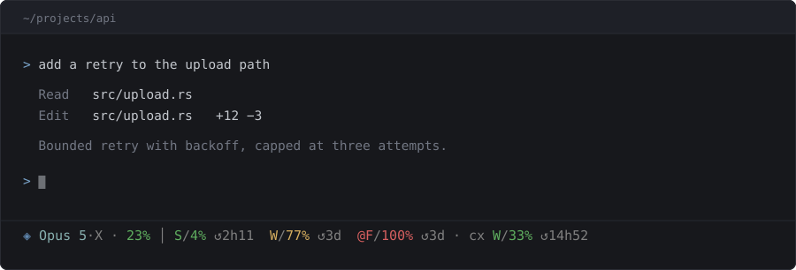
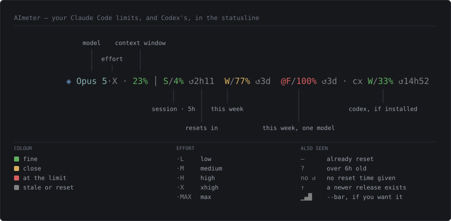

# AImeter

Your Claude Code rate limits, in the statusline — and Codex's beside them, if you use
it. One binary, ~2 ms, no daemon.



## What you are looking at



## Get it

```bash
curl -fsSL https://raw.githubusercontent.com/MarioPayan/AImeter/main/install.sh | sh
```

Downloads the right binary, wires your statusline, and is safe to run twice — it backs up
an existing statusline script before appending, and never overrides a `statusLine` you
already set. Pass `--no-wire` to skip the wiring. Short enough to
[read first](install.sh), which you should do with anything you pipe into a shell.

On Windows, in PowerShell — [the same script](install.ps1), the same rules:

```powershell
irm https://raw.githubusercontent.com/MarioPayan/AImeter/main/install.ps1 | iex
```

**Or ask Claude Code:**

> Install AImeter from github.com/MarioPayan/AImeter

Prefer to do it yourself? [Installing by hand](docs/how-it-works.md#installing-by-hand).
Have Rust? `cargo install aimeter`.

## Why

| | |
|---|---|
| **Already on screen** | You never ask. Asking Claude costs a round trip and some context |
| **Spends nothing** | No model call, no tokens, no context — it reads files and prints a line |
| **Four ceilings** | Session, week, capped model, context — the limits say when they reset |
| **Codex too** | Its limits follow behind a `cx` — only if Codex is installed, otherwise nothing changes |
| **Never lies** | Stale goes grey, a reset window shows `—`, a missing reset stays blank |
| **Nothing running** | No daemon, no database. ~2 ms per render; `node` costs 60–100 |

## With Codex

```
◈ Opus 5·X · 37% │ S/4% ↺2h11  W/41% ↺3d  @F/12% · cx W/33% ↺14h52
```

If [Codex](https://github.com/openai/codex) is on the machine, its ChatGPT-plan limits
follow Claude's behind a `cx`, read the same way: `W/33% ↺14h52` is a third of the week
spent, just under fifteen hours until it resets. They stay current while Codex is
closed, because the number comes from the endpoint Codex's own `/status` uses, with
Codex's session log as the fallback.

**No Codex, no `cx`.** Without a `~/.codex` directory none of this runs — nothing is
read, nothing is requested, and the segment is exactly the one in the pictures above.
With one, `AIMETER_NO_CODEX=1` hides it all the same. Reaching that endpoint means
reading the token in `~/.codex/auth.json`, under the same rules as Claude Code's:
[never written, never stored, and `AIMETER_NO_FETCH=1` stops it](docs/how-it-works.md#the-token).

**[How it works](docs/how-it-works.md)**
